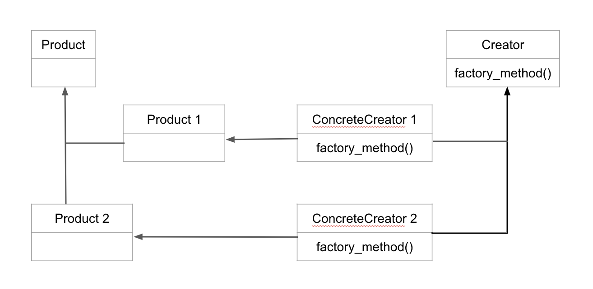

# Factory Pattern

Busca responder a pergunta: qual classe criar?

Estratégia: Delega a escolha de classes para subclasses.

Creators:
- base: contem os métodos da Factory (Pond)
- concrete: produzem alguma classe (DuckPond e FrogPond)

Products: as classes que efetivamente são criadas (Frog e Duck)

Pensando bem, podemos até considerar o *factory pattern* como um especialização do *template pattern* - uma classe genérica e subclasses que tratam especificidades. Só que aqui o problema específico é a escolha da classe a ser criada.

No entanto, imagine que além de animais desejemos adicionar plantas a lagoa, de dois tipos. Se queremos que cada lagoa tenha 1 tipo de planta e 1 animal, já seria 4 *creators* concretos necessários, e é fácil ver isso escalando rapidamente. Para evitar isso, podemos:
- Saber se vamos criar uma planta ou um animal usando symbols
- Passar a classe como parâmetro

Mas os requerimentos não param de crescer e agora, além de uma lagoa, queremos uma selva, também com animais e plantas, com exatamente as mesmas interfaces. Da maneira que fizemos isso é simples: basta a classe Pond ser algo mais genérico, como Habitat, e todo o resto funciona normalmente.
